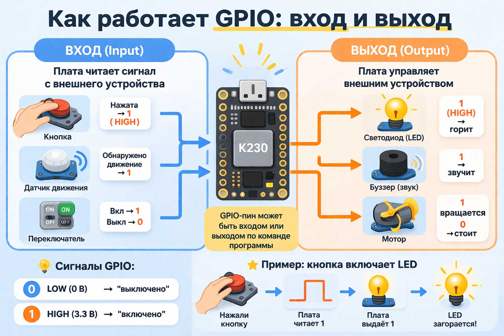

# Примеры K230: Кнопка, RGB LED, Динамик

Добро пожаловать! Эта папка содержит **5 простых примеров** для начала работы с платой K230. 
Здесь вы научитесь управлять кнопкой, светодиодом и динамиком.

## 📚 Что вы узнаете

- Как читать состояние кнопки
- Как управлять RGB светодиодом (разные цвета)
- Как воспроизводить звуки через динамик
- Как комбинировать несколько компонентов вместе

## 🛠️ Требования

### Программные
- Python 3.x
- Библиотека `ybUtils` (уже установлена на плате K230)

### Оборудование
- Плата K230
- Кнопка (подключена к GPIO61)
- RGB светодиод
- Динамик (buzzer)

## 📦 Установка

1. **Убедитесь, что Python работает на вашей плате:**
   ```bash
   python --version
   ```

2. **Установите библиотеку `ybUtils`** (если ещё не установлена):
   ```bash
   pip install ybUtils
   ```

3. **Подключите компоненты:**

   | Компонент | Подключение | Примечание |
   |-----------|-------------|------------|
   | Кнопка | GPIO61 | Использует подтяжку вверх (PULL_UP) |
   | RGB LED | GPIO пины платы | Проверьте тип (общий анод/катод) |
   | Динамик | Через резистор | Для защиты платы |

   > 💡 **Важно о кнопке:** 
   > - Не нажата = логическая "1" (высокий уровень)
   > - Нажата = логическая "0" (низкий уровень)
   > - Это называется "активный низкий уровень"

## 📋 Список примеров

| № | Файл | Что делает | Сложность |
|---|------|------------|-----------|
| 1 | [01_button_basic.py](01_button_basic.py) | Читает состояние кнопки и выводит в консоль | ⭐ Легко |
| 2 | [02_button_led.py](02_button_led.py) | Кнопка включает/выключает светодиод | ⭐⭐ Просто |
| 3 | [03_rgb_led.py](03_rgb_led.py) | Кнопка переключает 7 цветов RGB LED | ⭐⭐ Просто |
| 4 | [04_speaker_basic.py](04_speaker_basic.py) | Кнопка воспроизводит звуковой сигнал | ⭐⭐ Просто |
| 5 | [05_button_rgb_speaker.py](05_button_rgb_speaker.py) | Комбинация: кнопка + цвет + звук | ⭐⭐⭐ Средне |

## 🚀 Как запустить

### Запуск примера

Выберите пример и выполните команду:

```bash
python 01_button_basic.py
```

Или любой другой:
```bash
python 02_button_led.py
python 03_rgb_led.py
python 04_speaker_basic.py
python 05_button_rgb_speaker.py
```

### Что вы увидите

**Пример 1 (кнопка):**
```
Старт примера: нажимайте пользовательскую кнопку на плате K230
Кнопка нажата!
Кнопка нажата!
```

**Пример 2 (кнопка + LED):**
- Светодиод загорается при нажатии кнопки
- Выключается когда отпустите кнопку

**Пример 3 (RGB LED):**
- Каждое нажатие кнопки меняет цвет:
  - 🔴 Красный → 🟢 Зелёный → 🔵 Синий → 🟡 Жёлтый → 🩵 Голубой → 🟣 Фиолетовый → ⬛ Выкл

**Пример 4 (динамик):**
- При нажатии кнопки слышен короткий звуковой сигнал

**Пример 5 (комбинированный):**
- Режим 0: 🔴 Красный + звуковой сигнал
- Режим 1: 🟢 Зелёный без звука
- Режим 2: 🔵 Синий без звука

## 🔧 Отладка и решение проблем

### Проблема: Кнопка не реагирует
**Решение:**
- Проверьте подключение к GPIO61
- Убедитесь, что кнопка исправна
- Проверьте, что используется подтяжка вверх

### Проблема: Нет звука
**Решение:**
- Проверьте подключение динамика
- Убедитесь, что динамик рабочий
- Проверьте контакты

### Проблема: Неправильные цвета RGB
**Решение:**
- Проверьте порядок подключения проводов (R, G, B)
- Узнайте тип светодиода (общий анод или катод)
- При необходимости инвертируйте значения

## 📖 Полезные понятия

### Что такое GPIO?
**GPIO** (General Purpose Input/Output) — это универсальные выводы микроконтроллера, 
которые можно программировать как вход (чтение) или выход (управление).



### Что такое подтяжка (pull-up)?
**Подтяжка вверх** — это резистор, который соединяет вывод с питанием (+3.3V).
Когда кнопка не нажата, вывод читает "1". При нажатии — соединяется с землёй и читает "0".

### Что такое RGB LED?
**RGB светодиод** содержит три светодиода в одном корпусе:
- **R** (Red) — красный
- **G** (Green) — зелёный  
- **B** (Blue) — синий

Комбинируя яркость каждого, можно получить любой цвет.

## 🎯 Следующие шаги

После изучения этих примеров попробуйте:
1. Изменить цвета в примере 3 на свои любимые
2. Сделать мелодию вместо простого сигнала
3. Добавить таймер или счётчик нажатий
4. Объединить примеры своими идеями!

## ❓ Вопросы?

Если что-то непонятно:
- Перечитайте комментарии в коде каждого примера
- Экспериментируйте с параметрами
- Изучите документацию `ybUtils`

Удачи в изучении! 🎉
